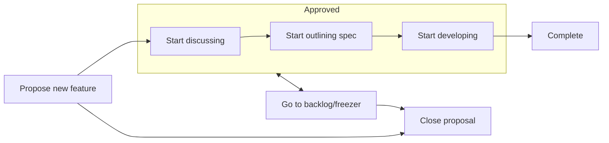

# Contributing

We welcome your input and contributions to all aspects of Windows App SDK:

- Report bugs
- Propose features
- Ask questions
- Start discussions
- Improve docs
- Improve API specs
- Report security issues
- Fix bugs
- Develop new features

## Triage issues/PRs

The team manages issues and PRs using a process we call
"triage". It helps us keep issues organized to make sure all issues have one or more area owners (as in area-AppContainer, area-Win32, etc), and focuses the attention of the different
groups that work in the project. New issues are automatically labeled `needs-triage`. If issue/PR author needs to provide more info, we add `needs-author-feedback` and after a few days past with no activity, we add `status-no-recent-activity`. 10 days after then with no activity, we close it.

## Proposal review flow

## Report security issues

For reporting security issues please see the [Security Policy](../.github/SECURITY.md).

## Contribute to the codebase

### Contribution bar

The team accepts your code changes that improve Windows App SDK or fix bugs, as long as you follow the processes outlined below and broadly align with current [roadmap](ROADMAP.md).

While we strive to accept all community contributions that meet the guidelines outlined here, please note that we may not merge changes that have narrowly-defined benefits due to compatibility risks and maintenance costs, and revert changes if they are found to be causing issues.

### Set up environment

### Contributor License Agreement

Most contributions require you to agree to a Contributor License Agreement (CLA) declaring that you have the right to, and actually do, grant us
the rights to use your contribution. For details, visit https://cla.opensource.microsoft.com.

When you submit a pull request, a CLA bot will automatically determine whether you need to provide
a CLA and decorate the PR appropriately (e.g., status check, comment). Simply follow the instructions
provided by the bot. You will only need to do this once across all repos using our CLA.
