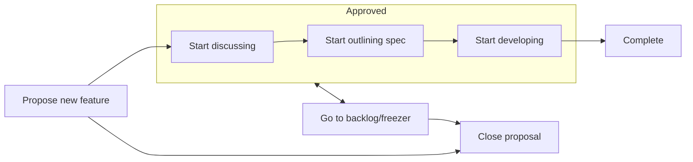

# Contributing

- [Overview](#overview)
- [Triage process for issues/PRs](#triage-process-for-issuesprs)
- [Proposal review flow](#proposal-review-flow)
- [Report security issues](#report-security-issues)
- [Contribution bar](#contribution-bar)
- [Contributor License Agreement](#contributor-license-agreement)
- [Prepare for development](#prepare-for-development)
- [Run tests for API](#run-tests-for-api)

## Overview

We welcome your input and contributions to all aspects of Windows App SDK: you can report bugs, propose features, ask questions, start discussions, improve docs, improve API specs, report security issues, fix bugs, and develop new features.

## Triage process for issues/PRs

The team manages issues and PRs using a process we call
"triage". It helps us keep issues organized to make sure all issues have one or more area owners (as in area-AppContainer, area-Win32, etc), and focuses the attention of the different
groups that work in the project. New issues are automatically labeled `needs-triage`. If issue/PR author needs to provide more info, we add `needs-author-feedback` and after a few days past with no activity, we add `status-no-recent-activity`. 10 days after then with no activity, we close it.

## Proposal review flow



## Report security issues

For reporting security issues please see the [Security Policy](../.github/SECURITY.md).

## Contribution bar

The team accepts your code changes that improve Windows App SDK or fix bugs, as long as you follow the processes outlined below and broadly align with current [roadmap](ROADMAP.md).

While we strive to accept all community contributions that meet the guidelines outlined here, please note that we may not merge changes that have narrowly-defined benefits due to compatibility risks and maintenance costs, and revert changes if they are found to be causing issues.

## Contributor License Agreement

Most contributions require you to agree to a Contributor License Agreement (CLA) declaring that you have the right to, and actually do, grant us
the rights to use your contribution. For details, visit https://cla.opensource.microsoft.com.

When you submit a pull request, a CLA bot will automatically determine whether you need to provide
a CLA and decorate the PR appropriately (e.g., status check, comment). Simply follow the instructions
provided by the bot. You will only need to do this once across all repos using our CLA.

## Prepare for development

### 1. Install required components

- Windows 10 SDK 10.0.17763.0 (RS5)
- Windows 11 SDK 10.0.26100.2454 (24H2)
- Visual Studio 2022
  - .NET desktop development
  - Desktop development with C++
  - Universal Windows Platform development

There are a lot of indivisual components listed in VisualStudio2022.vsconfig, which you can install by `More` > `Import configuration`.

### 2. Clone the repo

```
cd <PATH TO CLONED WASDK REPO DIR>
git clone https://github.com/micrsoft/WindowsAppSDK.git
nuget restore
```

### 3. Run DevCheck.cmd

Run `DevCheck.cmd` from Run with Ctrl+Shift+Enter (as admin) in order to:

- Verify Developer Mode is enabled.
- Verify Visual Studio is installed with the required components.
- Create a test certificate and add it to the certificate store. Used to sign test packages for inner-loop development and testing.
- Install the TAEF service (TE.Service). Used by TAEF to enable test functionality (e.g. RunAs).
- Verify the project's dependencies are sanctioned and using the correct version(s).

> [!NOTE]
> This is needed **only once** to enable your machine to develop Windows App SDK. It may be needed again in the future at rare intervals e.g. the test certificate usually expires a year from its issue date) or if a dependency has an update. When in doubt you can always run DevCheck.cmd as it's harmless if your configuration is current with no changes needed.

### 4. Open the solution

Now you're ready to open `WindowsAppRuntime.sln` and start development. Please ensure:

- If VS starts in a configuration of Any CPU, switch to a specific architecture like `x64` to successfully build.
- Build everything in VS via `Build` > `Build Solution` or `Rebuild Solution`.
- Right-click on individual projects in Solution Explorer to only build selected projects. Dependencies and Build Order should be defined to build prerequisites (if necessary) for the selected project.

Use `msbuild.exe` for command line builds (see msbuild docs for more details):

- **Clean Solution, Debug/x64**: `msbuild WindowsAppSDK.sln -t:Clean -p:Configuration=Debug -p:Platform=X64`
- **Build solution, Debug/x64**: `msbuild WindowsAppSDK.sln -t:Build -p:Configuration=Debug -p:Platform=X64`
- **Rebuild Solution, Debug/x64**: `msbuild WindowsAppSDK.sln -t:Rebuild -p:Configuration=Debug -p:Platform=X64`
- **Build solution, create binary log**: `msbuild WindowsAppSDK.sln -t:Rebuild -p:Configuration=Debug -p:Platform=X64 -bl`
- **Build solution, detailed summary of execution**: `msbuild WindowsAppSDK.sln -t:Rebuild -p:Configuration=Debug -p:Platform=X64 -ds`

Troubleshoot build problems by enabling binary logging (e.g. msbuild...-bl) and use MSBuild Binary and Structured Log Viewer to review the log.

## Run tests for API

Use Test Explorer to view and run tests via the View menu's Test Explorer:

- Right-click in `Test Explorer` > `Run` or `Debug` to run or debug a subset or individual tests
- Run `TAEF` tests from the command line (e.g. assuming current directory is `BuildOutput\Debug\x64`) (see TAEF documentation for more details):
  - **Run all tests in a DLL**: `te.exe DynamicDependency_Test_Win32\DynamicDependency_Test_Win32.dll`
  - **Run all tests in multiple DLLs**: `te.exe DynamicDependency_Test_Win32\DynamicDependency_Test_Win32.dll AppLifecycleTests\AppLifecycleTests.dll`
  - **Run some tests in a DLL**: `te.exe DynamicDependency_Test_Win32\DynamicDependency_Test_Win32.dll /name=*Create*`
  - **Run tests only displaying per-tests reults and errors**: `te.exe DynamicDependency_Test_Win32\DynamicDependency_Test_Win32.dll /logoutput:low`

